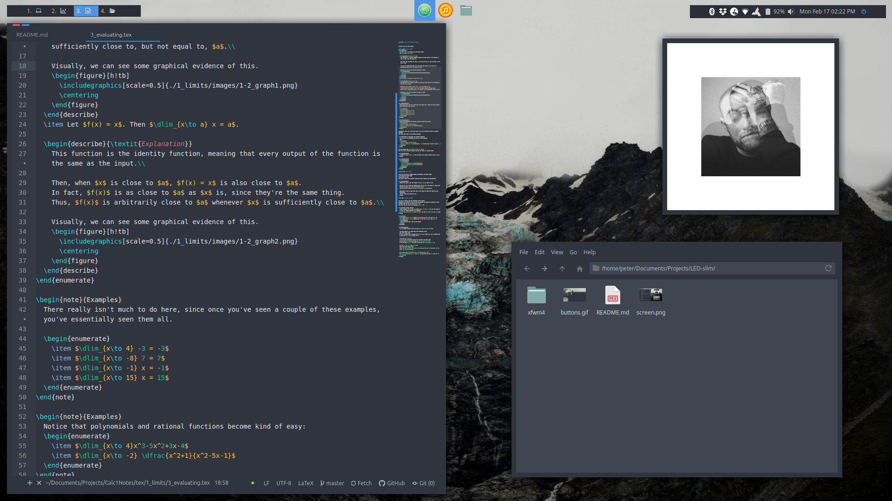
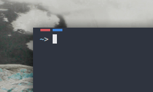

# LED-slim

This is a window border for XFCE. It uses the Arc color scheme (kind of), so it pairs nicely with the Arc GTK theme.

## Screenshots

## Installation

Just clone this to your themes folder (but first make sure there is no `.git` folder inside your `~/.themes` folder: if you find it just delete it).

`git clone https://github.com/peterkeep/LED-slim.git ~/.themes`

Then apply a theme You desire using Window Manager settings.

## Credits

I heavily borrowed from addy-dclxvi's themes: https://github.com/addy-dclxvi/xfwm4-theme-collections. Thanks, addy!
